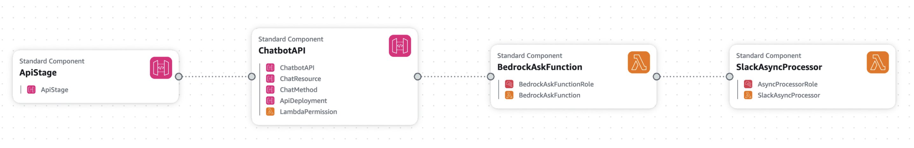
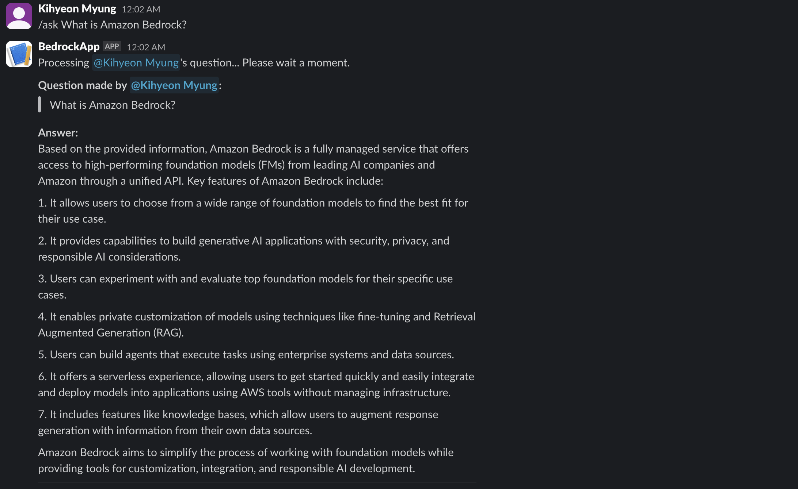

# Bedrock Slack Chatbot

This project implements a RAG chatbot that enables Q&A interactions in Slack using Amazon Bedrock Knowledge Base.

## Implementation Process

### 1. Knowledge Base Setup

1. Upload Documents to Amazon S3
    - Create an S3 bucket
    - Upload document files (PDF, TXT, etc.)

2. Create Bedrock Knowledge Base
    - Navigate to Bedrock service in AWS Console
    - Select "Create Knowledge Base" from Knowledge Base menu
    - Set Knowledge Base name
    - Choose the created S3 bucket as Data source
    - Configure Vector store (default settings can be used)
    - After creation, click "Sync" button to index documents in vector store

For detailed setup instructions, refer to [AWS Official Documentation](https://docs.aws.amazon.com/bedrock/latest/userguide/knowledge-base-create.html).

### 2. CloudFormation Stack Deployment

1. Go to CloudFormation service in AWS Console
2. Select "Create stack" → "With new resources (standard)"
3. Choose "Upload a template file" in Template source
4. Upload bedrock-slack-chatbot-deployment.yaml file from this repository
5. Enter stack name and set parameters:
    - KnowledgeBaseId: ID of the created Knowledge Base
    - RegionName: Region where Bedrock service is available (e.g., us-west-2)
    - ModelId: Bedrock model ID to use (default: anthropic.claude-3-sonnet)
6. After stack creation, check API Gateway URL in Outputs tab




#### Deployed Resources:

- BedrockAskFunction: Receives requests from Slack and invokes another Lambda function for async processing
- SlackAsyncProcessor: Performs Knowledge Base search and generates responses through Bedrock
- API Gateway endpoint
- Required IAM roles and policies
- You can test it on Lambda using test event like below:
    ```
    {
    "version": "2.0",
    "routeKey": "POST /ask",
    "rawPath": "/ask",
    "rawQueryString": "",
    "headers": {
        "content-type": "application/x-www-form-urlencoded",
        "user-agent": "Slackbot 1.0"
    },
    "requestContext": {
        "accountId": "168253315588",
        "apiId": "ccpume4igh",
        "http": {
        "method": "POST",
        "path": "/ask",
        "protocol": "HTTP/1.1",
        "sourceIp": "127.0.0.1",
        "userAgent": "Slackbot 1.0"
        }
    },
    "body": "token=test-token&channel_id=C07TFFDA9P1&channel_name=test-channel&user_id=U123456&user_name=testuser&command=/ask&text=What is Amazon Bedrock?&response_url=https://hooks.slack.com/commands/TEST123",
    "isBase64Encoded": false
    }
    ```

### 3. Slack App Configuration

1. Create Slack App
    - Click "Create New App" at Slack API website
    - Select "From scratch"
    - Choose app name and workspace

2. Configure Bot Token Scopes
    - Go to "OAuth & Permissions" menu
    - Add following permissions in "Scopes" section:
        `chat:write`
        `chat:write.public`
        `commands`
            
3. Set up Slash Command
    - Navigate to "Slash Commands" menu
    - Click "Create New Command"
    - Command: /ask (or your preferred command)
    - Request URL: Enter API Gateway URL from CloudFormation Outputs
    - Short Description: "Ask questions to Bedrock Knowledge Base"
    - Usage Hint: "[your question]"

4. Install App
    - Go to "Install App" menu
    - Click "Install to Workspace"
    - Authorize permissions

### 4. Usage

- Use the configured slash command in Slack channel
```/ask What is Amazon Bedrock?```
- Bot searches Knowledge Base and provides response
